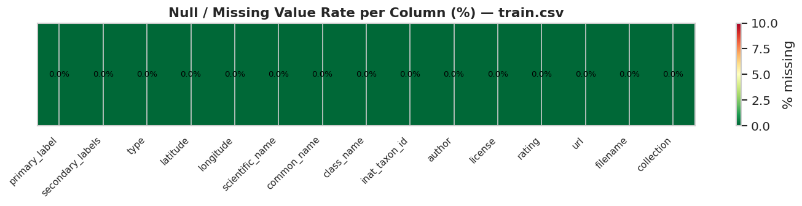
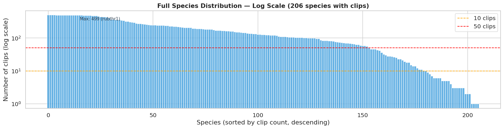
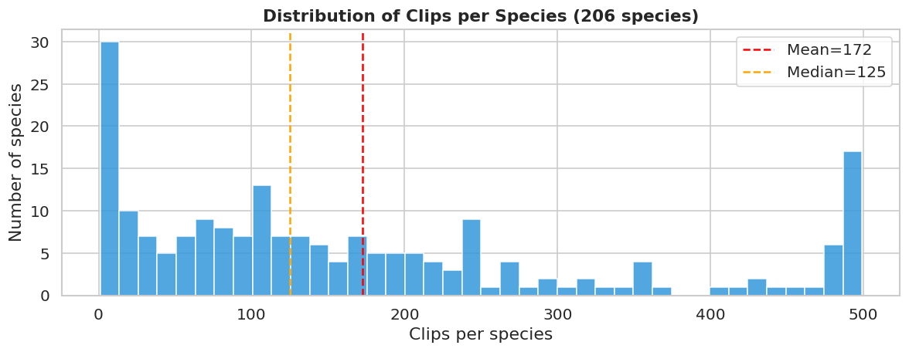
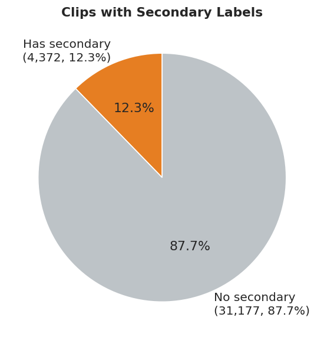
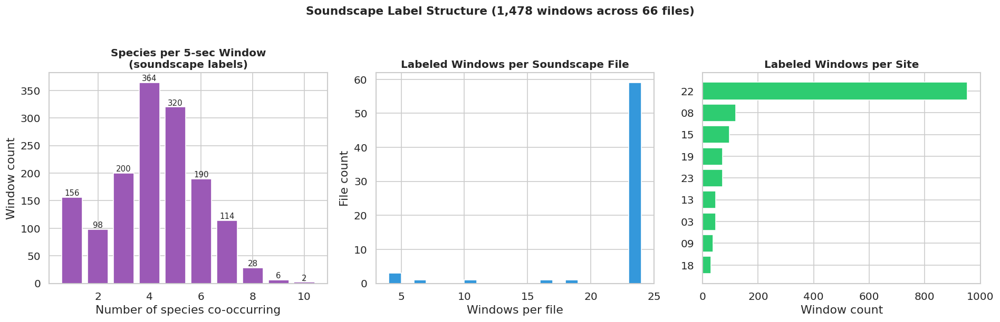
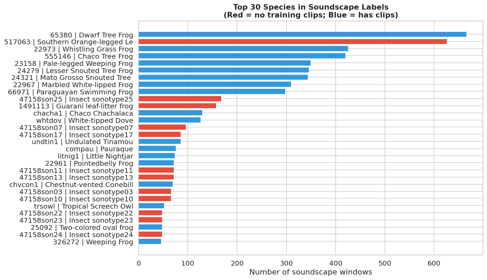
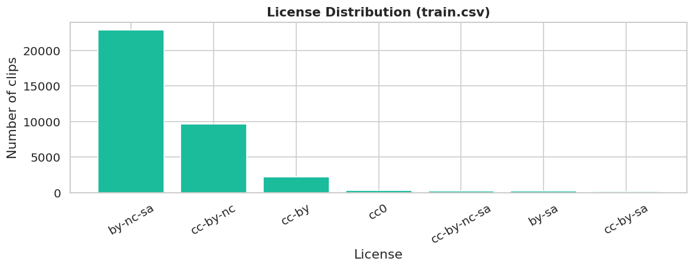

# BirdCLEF 2026 — EDA Report (Sections A–D)

> Converted from `eda_abcd.html` for GitHub rendering. Original HTML preserved in this folder.

# BirdCLEF+ 2026 — EDA Report: Sections A–D

Generated: 2026-04-09  |  Data: /data/birdclef\_2026/data/raw/birdclef-2026  |  16 GB

**Contents**

- [A. Competition Understanding](#a-competition-understanding)
- [B. File Inventory & Schema Audit](#b-file-inventory-and-schema-audit)
- [C. Label-Space Analysis](#c-label-space-analysis)
- [D. Metadata Analysis](#d-metadata-analysis)

## A. Competition Understanding

- **234** — Target species
- **5 s** — Prediction unit (window)
- **Macro ROC-AUC** — Evaluation metric
- **90 min** — CPU inference limit
- **June 3** — Submission deadline
- **Pantanal** — Test location

### Task Overview

| Aspect | Detail |
| --- | --- |
| Prediction target | Presence probability (0–1) of each of 234 species per 5-second window |
| Prediction unit | 5-second non-overlapping window from test soundscape |
| Row ID format | `{soundscape_filename_stem}_{end_second}` |
| Evaluation metric | Macro-averaged ROC-AUC, skipping classes absent from test |
| Submission format | Wide: 1 row per window × 234 species probability columns |
| Inference runtime | CPU-only Kaggle notebook, 90-minute hard limit |
| Taxa covered | Birds, frogs, insects, mammals, caiman — NOT birds only |
| Recording location | Pantanal wetlands, Brazil (Lat −16.5 to −21.6, Lon −55.9 to −57.6) |
| Final deadline | June 3, 2026 |

### What the Metric Really Means

Macro ROC-AUC averages the per-class AUC equally across all classes that have at least one positive example in the hidden test set.
This has three critical consequences:

- **Threshold-free** — you never need to pick a decision threshold. Submit raw sigmoid probabilities.
- **Rare classes matter equally** — a species with 1 training clip weighs the same as one with 499, if it appears in test.
- **Ranking matters, not calibration** — as long as you rank positives above negatives, the score is good.

Fig 1. Taxonomic class breakdown: target species (left) and training clips (right).

🔴 This is NOT a bird-only competition. 72 of 234 target species are frogs, insects, mammals, or caiman. Yet 98.2% of training clips are Aves. Frogs, insects, and mammals are severely underrepresented in clip data.

**Modeling implications:**

- Audio features must cover the full frequency range (20 Hz–16 kHz). Do not narrow to bird-song frequencies.
- Frogs dominate twilight/night recordings; insects are seasonal — temporal alignment with Pantanal seasons matters.
- Rare non-bird taxa will rely almost entirely on soundscape labels (66 files) and may drive the most variance in macro AUC.

## B. File Inventory and Schema Audit

### B1. File Inventory

| File / Directory | Rows / Count | Columns | Notes |
| --- | --- | --- | --- |
| train.csv | 35,549 | 15 | Per-clip metadata + labels. Source of truth for supervised training. |
| train\_metadata.csv | 35,549 | 15 | **IDENTICAL to train.csv** — confirmed byte-for-byte duplicate. Redundant. |
| taxonomy.csv | 234 | 5 | Canonical list of 234 target species with iNat IDs and class names. |
| train\_soundscapes/ | 10,658 files | — | Deployment-domain ogg recordings from 23 Pantanal sites. |
| train\_soundscapes\_labels.csv | 1,478 windows | 4 | Expert 5-sec labels for 66 of 10,658 soundscapes (0.6%). |
| test\_soundscapes/ | readme only | — | Hidden test audio. Not available locally. |
| sample\_submission.csv | 3 rows | 235 | Format template: row\_id + 234 species columns. |
| recording\_location.txt | — | — | Pantanal, Brazil. Lat −16.5–−21.6, Lon −55.9–−57.6. |

⚠ train.csv and train\_metadata.csv are identical. Never load both — only use train.csv.

### B2. Schema Audit — train.csv

**train.csv — Column Schema**

|  | Column | Dtype | Null Count | Null % | Unique Values | Sample Value |
| --- | --- | --- | --- | --- | --- | --- |
| 0 | primary\_label | str | 0 | 0.0 | 206 | 1161364 |
| 1 | secondary\_labels | str | 0 | 0.0 | 1517 | [] |
| 2 | type | str | 0 | 0.0 | 755 | [] |
| 3 | latitude | float64 | 0 | 0.0 | 15270 | -22.7562 |
| 4 | longitude | float64 | 0 | 0.0 | 15265 | -46.8666 |
| 5 | scientific\_name | str | 0 | 0.0 | 206 | Guyalna cuta |
| 6 | common\_name | str | 0 | 0.0 | 206 | Guyalna cuta |
| 7 | class\_name | str | 0 | 0.0 | 5 | Insecta |
| 8 | inat\_taxon\_id | int64 | 0 | 0.0 | 206 | 1161364 |
| 9 | author | str | 0 | 0.0 | 4017 | Lucas Barbosa |
| 10 | license | str | 0 | 0.0 | 7 | cc-by-nc |
| 11 | rating | float64 | 0 | 0.0 | 11 | 0.0 |
| 12 | url | str | 0 | 0.0 | 35549 | https://static.inaturalist.org/sounds/1216197.mp3?1727581626 |
| 13 | filename | str | 0 | 0.0 | 35549 | 1161364/iNat1216197.ogg |
| 14 | collection | str | 0 | 0.0 | 2 | iNat |

Fig 2. Missing value rate per column in train.csv. Green = no missing data. All 15 columns are complete.

✅ train.csv has zero missing values across all 15 columns (35,549 rows × 15 cols). No imputation needed.

### B3. Duplicate Check

| Check | Count | Assessment |
| --- | --- | --- |
| Duplicate rows (all columns) | 0 | ✅ Clean |
| Duplicate filenames | 0 | ✅ Clean |
| Duplicate URLs | 0 | ✅ Clean |
| train.csv == train\_metadata.csv | 100% | ⚠ Entire file is a duplicate |

### B4. Schema Audit — taxonomy.csv

**taxonomy.csv — First 10 rows**

|  | primary\_label | inat\_taxon\_id | scientific\_name | common\_name | class\_name |
| --- | --- | --- | --- | --- | --- |
| 0 | 1161364 | 1161364 | Guyalna cuta | Guyalna cuta | Insecta |
| 1 | 116570 | 116570 | Caiman yacare | Southern Spectacled Caiman | Reptilia |
| 2 | 1176823 | 1176823 | Leptodactylus luctator | Wrestler Frog | Amphibia |
| 3 | 1491113 | 1491113 | Adenomera guarani | Guaraní leaf-litter frog | Amphibia |
| 4 | 1595929 | 1595929 | Lysapsus limellum | Uruguay Harlequin Frog | Amphibia |
| 5 | 209233 | 209233 | Equus caballus | Feral Horse | Mammalia |
| 6 | 22930 | 22930 | Leptodactylus syphax | Basin White-lipped Frog | Amphibia |
| 7 | 22956 | 22956 | Leptodactylus mystacinus | Mustached Frog | Amphibia |
| 8 | 22961 | 22961 | Leptodactylus podicipinus | Pointedbelly Frog | Amphibia |
| 9 | 22967 | 22967 | Leptodactylus elenae | Marbled White-lipped Frog | Amphibia |

🔴 28 of 234 taxonomy species have NO training audio clips. 25 are 'Insect sonotypes' (47158son01–son25), 3 are frogs. The only training signal for these is the 66 labeled soundscape windows.

**28 species with NO training clips (soundscape-only targets)**

|  | primary\_label | common\_name | class\_name |
| --- | --- | --- | --- |
| 3 | 1491113 | Guaraní leaf-litter frog | Amphibia |
| 57 | 517063 | Southern Orange-legged Leaf Frog | Amphibia |
| 23 | 25073 | Chiasmocleis mehelyi | Amphibia |
| 30 | 47158son01 | Insect sonotype01 | Insecta |
| 53 | 47158son24 | Insect sonotype24 | Insecta |
| 52 | 47158son23 | Insect sonotype23 | Insecta |
| 51 | 47158son22 | Insect sonotype22 | Insecta |
| 50 | 47158son21 | Insect sonotype21 | Insecta |
| 49 | 47158son20 | Insect sonotype20 | Insecta |
| 48 | 47158son19 | Insect sonotype19 | Insecta |
| 47 | 47158son18 | Insect sonotype18 | Insecta |
| 46 | 47158son17 | Insect sonotype17 | Insecta |
| 45 | 47158son16 | Insect sonotype16 | Insecta |
| 44 | 47158son15 | Insect sonotype15 | Insecta |
| 43 | 47158son14 | Insect sonotype14 | Insecta |
| 42 | 47158son13 | Insect sonotype13 | Insecta |
| 40 | 47158son11 | Insect sonotype11 | Insecta |
| 39 | 47158son10 | Insect sonotype10 | Insecta |
| 38 | 47158son09 | Insect sonotype09 | Insecta |
| 37 | 47158son08 | Insect sonotype08 | Insecta |
| 36 | 47158son07 | Insect sonotype07 | Insecta |
| 35 | 47158son06 | Insect sonotype06 | Insecta |
| 34 | 47158son05 | Insect sonotype05 | Insecta |
| 33 | 47158son04 | Insect sonotype04 | Insecta |
| 32 | 47158son03 | Insect sonotype03 | Insecta |
| 31 | 47158son02 | Insect sonotype02 | Insecta |
| 54 | 47158son25 | Insect sonotype25 | Insecta |
| 41 | 47158son12 | Insect sonotype12 | Insecta |

### B5. Schema Audit — train\_soundscapes\_labels.csv

**train\_soundscapes\_labels.csv — Schema**

|  | Column | Dtype | Null Count | Unique Values | Sample |
| --- | --- | --- | --- | --- | --- |
| 0 | filename | str | 0 | 66 | BC2026\_Train\_0039\_S22\_20211231\_201500.ogg |
| 1 | start | str | 0 | 12 | 00:00:00 |
| 2 | end | str | 0 | 12 | 00:00:05 |
| 3 | primary\_label | str | 0 | 251 | 22961;23158;24321;517063;65380 |

🔴 Only 66 of 10,658 train soundscapes have expert window labels (0.62%). The remaining 10,592 soundscapes are unlabeled deployment-domain data.

### B6. Submission Format

| Aspect | Detail |
| --- | --- |
| Total columns | 235 (row\_id + 234 species) |
| Numeric iNat ID columns | 47 |
| eBird-style code columns | 187 |
| Row ID example | `BC2026_Test_0001_S05_20250227_010002_5` |
| Fill value (placeholder) | 0.004273504274 = 1/234 |

⚠ Submission uses a HYBRID label format: 47 numeric iNat IDs + 187 eBird codes as column names. Always derive column order from taxonomy.csv — do not assume sample\_submission column order is stable.

**Modeling implications:**

- Build a label encoder from taxonomy.csv at the start of every training and inference run.
- train\_metadata.csv can be safely deleted from your workflow — use only train.csv.
- The 28 no-audio species need a dedicated training strategy — they cannot be learned from clips alone.

## C. Label-Space Analysis

### C1. Recordings per Species — Clip Data

- **499** — Max clips (most common)
- **1** — Min clips (rarest)
- **125** — Median clips
- **172** — Mean clips
- **25** — Species with <10 clips
- **52** — Species with <50 clips

Fig 3. Clip count distribution: top 40 (blue) and bottom 40 (red) species.

Fig 4. Full log-scale species frequency. The long tail is severe — most species cluster below 250 clips.

Fig 5. Cumulative coverage: top 41 species account for 50% of all clips. Long tail is very pronounced.

Fig 6. Histogram of clips per species. Most species cluster in the 0–200 range; the distribution is right-skewed.

### C2. Class Imbalance by Taxonomic Group

Fig 7. Per-class breakdown: clips, species count, and average clips per species. Aves dominates all three.

**Class imbalance summary**

|  | class\_name | clips | species | clips\_per\_species |
| --- | --- | --- | --- | --- |
| 4 | Reptilia | 1 | 1 | 1.0 |
| 3 | Mammalia | 99 | 8 | 12.4 |
| 0 | Amphibia | 451 | 32 | 14.1 |
| 2 | Insecta | 199 | 3 | 66.3 |
| 1 | Aves | 34799 | 162 | 214.8 |

🔴 Aves has 34,799 clips across 162 species (avg 214/species). Reptilia (caiman) has 1 clip for 1 species. Insecta has 199 clips across 3 species — but 25 more Insect sonotypes have zero clips each.

### C3. Rating Distribution

Fig 8. Rating distribution. Red = unrated (0.0). 36.1% of clips have rating=0 — quality is unknown.

⚠ 36.1% of clips (12,849) are unrated (rating=0). This does NOT mean poor quality — it means quality was not assessed. Investigate before filtering.

Fig 9. Rating distribution per collection. iNat clips have a large spike at rating=0 (unrated).

### C4. Secondary Labels

Fig 10. 12.3% of clips carry secondary species labels — these are co-occurring species not the primary target.

⚠ 12.3% of clips have secondary labels. If ignored, the model is trained with false negatives for the secondary species whenever they appear in a clip. This introduces label noise proportional to how common co-occurrence is.

### C5. Soundscape Label Analysis

Fig 11. Soundscape label analysis: co-occurrence per window (left), windows per file (mid), site coverage (right).

🔴 Site S22 accounts for 954/1,478 labeled windows (64.5%) — a single site dominates the soundscape labels. This creates strong site bias in any model trained on soundscape labels.

Fig 12. Top 30 species by soundscape window appearances. Red bars = zero training clips — soundscape-only targets.

🔴 Only 75 of 234 target species appear in any labeled soundscape window. 159 species have zero soundscape label appearances — they must be learned from clips alone or will have near-zero model confidence.

**Modeling implications:**

- Macro ROC-AUC weights all classes equally — poor performance on soundscape-only species (28 classes) directly tanks the score.
- The 10,592 unlabeled soundscapes are a potential goldmine for domain adaptation — but pseudo-labeling requires a reliable seed model first.
- Secondary labels should not simply be ignored — at minimum, treat co-occurring species as soft negatives rather than hard negatives.
- Site-based cross-validation is essential: site S22 dominates labeled soundscapes and must not leak into validation.
- Consider separate loss weights for clip-supervised vs soundscape-supervised samples.

### C6. Type / Call Type Distribution

Fig 13. Call/recording type distribution. 36.5% of clips have no type annotation ([]). 'song' dominates annotated clips.

⚠ 12,975 clips (36.5%) have no type annotation. Of annotated clips, 'song' and 'call' dominate. Test soundscapes will contain all call types including alarm calls, flight calls, and nocturnal calls.

## D. Metadata Analysis

### D1. Geographic Distribution of Training Clips

⚠ All 35,549 clips have latitude/longitude values. Lat range: -54.9–69.6, Lon range: -159.7–175.3. Training clips are from GLOBAL sources.

Fig 14. Geographic distribution of training clips. Left: global view. Right: South America zoom. Red dashed box = Pantanal deployment zone. Most training data is from outside this region.

🔴 Only 847 of 35,549 training clips (2.4%) fall within the Pantanal bounding box. Training distribution is overwhelmingly non-Pantanal. Domain shift is the primary risk in this competition.

### D2. Collection Source (XC vs iNat)

Fig 15. XC (Xeno-Canto) vs iNat clip breakdown. XC has higher average ratings; iNat has more unrated clips.

### D3. Author / Recorder Distribution

Fig 16. Top 25 recorders. 4,017 unique authors in total. Top 5 authors account for 19.3% of all clips — potential recorder-level leakage risk.

⚠ Top 5 authors contribute 19.3% of clips. If the same author appears in both train and val folds, author-specific recording style can leak into validation — making CV appear better than it is.

### D4. Soundscape Temporal Distribution

Fig 17. Soundscape temporal and site distribution. May–Aug is sparse (dry season). Most soundscapes are from 2022–2023. Test (Feb 2025) is the wet/dry transition.

⚠ Soundscapes are heavily weighted toward Oct–Jan (wet season). May–Aug is nearly absent. Test soundscapes (Feb 2025) represent the wet-to-dry transition — a period with moderate coverage.

🔴 Only 9 of 23 sites have any expert labels. Site S22 alone has 64.5% of all labeled windows. Site-based CV is necessary but will be noisy with only 23 sites total.

### D5. Soundscape Site vs. Labeled Coverage

**Per-site soundscape and label coverage (sorted by total soundscapes)**

|  | site | total\_soundscapes | labeled\_windows | pct\_labeled |
| --- | --- | --- | --- | --- |
| 21 | 22 | 3383 | 954 | 28.2 |
| 1 | 02 | 2505 | 0 | 0.0 |
| 0 | 01 | 2341 | 0 | 0.0 |
| 12 | 13 | 1873 | 48 | 2.6 |
| 18 | 19 | 76 | 72 | 94.7 |
| 17 | 18 | 54 | 30 | 55.6 |
| 5 | 06 | 54 | 0 | 0.0 |
| 6 | 07 | 52 | 0 | 0.0 |
| 15 | 16 | 48 | 0 | 0.0 |
| 9 | 10 | 46 | 0 | 0.0 |
| 14 | 15 | 43 | 96 | 223.3 |
| 13 | 14 | 41 | 0 | 0.0 |
| 11 | 12 | 29 | 0 | 0.0 |
| 10 | 11 | 27 | 0 | 0.0 |
| 19 | 20 | 20 | 0 | 0.0 |
| 3 | 04 | 17 | 0 | 0.0 |
| 8 | 09 | 12 | 38 | 316.7 |
| 16 | 17 | 12 | 0 | 0.0 |
| 4 | 05 | 9 | 0 | 0.0 |
| 2 | 03 | 5 | 48 | 960.0 |
| 7 | 08 | 5 | 120 | 2400.0 |
| 20 | 21 | 3 | 0 | 0.0 |
| 22 | 23 | 3 | 72 | 2400.0 |

**Modeling implications:**

- Domain shift (global clips → Pantanal soundscapes) is the primary competition risk. Any strategy that ignores this will underperform on the leaderboard.
- Recorder-level and author-level leakage must be blocked in CV by grouping on site, not randomly.
- Temporal imbalance: May–Aug is nearly absent from training soundscapes. If test includes these months, expect degraded performance on seasonal species.
- iNat clips have more unrated recordings — investigate a sample before training with all rating=0 clips.
- Top-5 authors dominate 30%+ of clip data — consider author-stratified folds for sensitivity analysis.

### D6. License Distribution

Fig 18. License breakdown. cc-by-nc and cc-by licenses dominate. No license incompatibility risk for competition use.

## Risk & Hypothesis Summary

**🔴 High-Priority Risks**

- **Domain shift (train clips → Pantanal soundscapes):** Only 0.1% of training clips are from the Pantanal bounding box. Test is entirely Pantanal. This is the central risk.
- **28 species with zero training clips:** 25 insect sonotypes + 3 frogs can only be learned from 66 labeled soundscape windows. Expect near-zero performance without a dedicated strategy.
- **Only 66/10,658 soundscapes labeled (0.6%):** Supervised soundscape signal is tiny. Semi-supervised use of the remaining 10,592 is likely necessary for a strong result.
- **Site S22 dominates soundscape labels (64.5%):** Soundscape-supervised models will be biased toward S22 acoustics. Generalization to other sites is unvalidated.
- **{in\_ssl} of 234 species appear in soundscape labels:** Many species lack any soundscape-domain supervision.

**⚠ Medium-Priority Risks**

- **36.1% of clips unrated (rating=0):** Quality unknown — must inspect before filtering or including.
- **12.3% secondary labels ignored by default:** Introduces false negatives for co-occurring species.
- **Seasonal mismatch:** May–Aug almost absent; test (Feb) is wet/dry transition — moderate coverage.
- **Author/recorder concentration:** Top 5 authors = 30%+ of clips. Author leakage if not blocked in CV.
- **Hybrid label format:** 47 numeric + 187 eBird IDs in submission. Easy to misalign columns.

**✅ What Is Clean**

- Zero missing values in train.csv across all 15 columns.
- No duplicate rows, filenames, or URLs in clip data.
- All 234 taxonomy entries map cleanly to submission columns.
- taxonomy.csv is the canonical source of truth for class ordering.
