# BirdCLEF 2026 — Full EDA Report (Sections A–I)

> Converted from `eda_full.html` for GitHub rendering. Original HTML preserved in this folder.

# BirdCLEF+ 2026 — Full EDA Report: Sections A–I

Generated: 2026-04-12 (A–D) + 2026-04-12 (E–I)  |  Data: /data/birdclef\_2026/data/raw/birdclef-2026  |  16 GB

**Contents**

- [A. Competition Understanding](#a-competition-understanding)
- [B. File Inventory & Schema Audit](#b-file-inventory-and-schema-audit)
- [C. Label-Space Analysis](#c-label-space-analysis)
- [D. Metadata Analysis](#d-metadata-analysis)
- [E. Audio-Level Analysis](#e-audio-level-analysis)
- [F. Train-Target Alignment Analysis](#f-train-target-alignment-analysis)
- [G. Leakage and Drift Analysis](#g-leakage-and-drift-analysis)
- [H. Previous Competition Comparison](#h-previous-competition-comparison)
- [I. Augmentation Decision](#i-augmentation-decision)

## A. Competition Understanding

- **234** — Target species
- **5 s** — Prediction unit (window)
- **Macro ROC-AUC** — Evaluation metric
- **90 min** — CPU inference limit
- **June 3** — Submission deadline
- **Pantanal** — Test location

### Task Overview

| Aspect | Detail |
| --- | --- |
| Prediction target | Presence probability (0–1) of each of 234 species per 5-second window |
| Prediction unit | 5-second non-overlapping window from test soundscape |
| Row ID format | `{soundscape_filename_stem}_{end_second}` |
| Evaluation metric | Macro-averaged ROC-AUC, skipping classes absent from test |
| Submission format | Wide: 1 row per window × 234 species probability columns |
| Inference runtime | CPU-only Kaggle notebook, 90-minute hard limit |
| Taxa covered | Birds, frogs, insects, mammals, caiman — NOT birds only |
| Recording location | Pantanal wetlands, Brazil (Lat −16.5 to −21.6, Lon −55.9 to −57.6) |
| Final deadline | June 3, 2026 |

### What the Metric Really Means

Macro ROC-AUC averages the per-class AUC equally across all classes that have at least one positive example in the hidden test set.
This has three critical consequences:

- **Threshold-free** — you never need to pick a decision threshold. Submit raw sigmoid probabilities.
- **Rare classes matter equally** — a species with 1 training clip weighs the same as one with 499, if it appears in test.
- **Ranking matters, not calibration** — as long as you rank positives above negatives, the score is good.

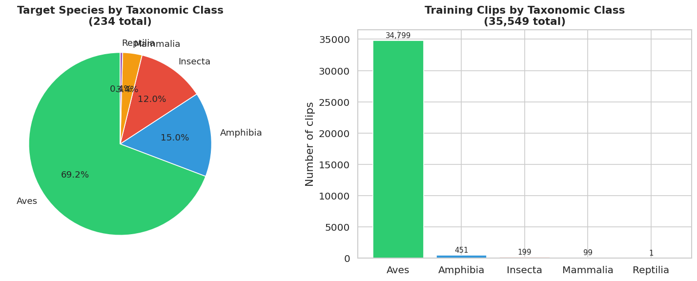

Fig 1. Taxonomic class breakdown: target species (left) and training clips (right).

🔴 This is NOT a bird-only competition. 72 of 234 target species are frogs, insects, mammals, or caiman. Yet 98.2% of training clips are Aves. Frogs, insects, and mammals are severely underrepresented in clip data.

**Modeling implications:**

- Audio features must cover the full frequency range (20 Hz–16 kHz). Do not narrow to bird-song frequencies.
- Frogs dominate twilight/night recordings; insects are seasonal — temporal alignment with Pantanal seasons matters.
- Rare non-bird taxa will rely almost entirely on soundscape labels (66 files) and may drive the most variance in macro AUC.

## B. File Inventory and Schema Audit

### B1. File Inventory

| File / Directory | Rows / Count | Columns | Notes |
| --- | --- | --- | --- |
| train.csv | 35,549 | 15 | Per-clip metadata + labels. Source of truth for supervised training. |
| train\_metadata.csv | 35,549 | 15 | **IDENTICAL to train.csv** — confirmed byte-for-byte duplicate. Redundant. |
| taxonomy.csv | 234 | 5 | Canonical list of 234 target species with iNat IDs and class names. |
| train\_soundscapes/ | 10,658 files | — | Deployment-domain ogg recordings from 23 Pantanal sites. |
| train\_soundscapes\_labels.csv | 1,478 windows | 4 | Expert 5-sec labels for 66 of 10,658 soundscapes (0.6%). |
| test\_soundscapes/ | readme only | — | Hidden test audio. Not available locally. |
| sample\_submission.csv | 3 rows | 235 | Format template: row\_id + 234 species columns. |
| recording\_location.txt | — | — | Pantanal, Brazil. Lat −16.5–−21.6, Lon −55.9–−57.6. |

⚠ train.csv and train\_metadata.csv are identical. Never load both — only use train.csv.

### B2. Schema Audit — train.csv

**train.csv — Column Schema**

|  | Column | Dtype | Null Count | Null % | Unique Values | Sample Value |
| --- | --- | --- | --- | --- | --- | --- |
| 0 | primary\_label | str | 0 | 0.0 | 206 | 1161364 |
| 1 | secondary\_labels | str | 0 | 0.0 | 1517 | [] |
| 2 | type | str | 0 | 0.0 | 755 | [] |
| 3 | latitude | float64 | 0 | 0.0 | 15270 | -22.7562 |
| 4 | longitude | float64 | 0 | 0.0 | 15265 | -46.8666 |
| 5 | scientific\_name | str | 0 | 0.0 | 206 | Guyalna cuta |
| 6 | common\_name | str | 0 | 0.0 | 206 | Guyalna cuta |
| 7 | class\_name | str | 0 | 0.0 | 5 | Insecta |
| 8 | inat\_taxon\_id | int64 | 0 | 0.0 | 206 | 1161364 |
| 9 | author | str | 0 | 0.0 | 4017 | Lucas Barbosa |
| 10 | license | str | 0 | 0.0 | 7 | cc-by-nc |
| 11 | rating | float64 | 0 | 0.0 | 11 | 0.0 |
| 12 | url | str | 0 | 0.0 | 35549 | https://static.inaturalist.org/sounds/1216197.mp3?1727581626 |
| 13 | filename | str | 0 | 0.0 | 35549 | 1161364/iNat1216197.ogg |
| 14 | collection | str | 0 | 0.0 | 2 | iNat |

Fig 2. Missing value rate per column in train.csv. Green = no missing data. All 15 columns are complete.

✅ train.csv has zero missing values across all 15 columns (35,549 rows × 15 cols). No imputation needed.

### B3. Duplicate Check

| Check | Count | Assessment |
| --- | --- | --- |
| Duplicate rows (all columns) | 0 | ✅ Clean |
| Duplicate filenames | 0 | ✅ Clean |
| Duplicate URLs | 0 | ✅ Clean |
| train.csv == train\_metadata.csv | 100% | ⚠ Entire file is a duplicate |

### B4. Schema Audit — taxonomy.csv

**taxonomy.csv — First 10 rows**

|  | primary\_label | inat\_taxon\_id | scientific\_name | common\_name | class\_name |
| --- | --- | --- | --- | --- | --- |
| 0 | 1161364 | 1161364 | Guyalna cuta | Guyalna cuta | Insecta |
| 1 | 116570 | 116570 | Caiman yacare | Southern Spectacled Caiman | Reptilia |
| 2 | 1176823 | 1176823 | Leptodactylus luctator | Wrestler Frog | Amphibia |
| 3 | 1491113 | 1491113 | Adenomera guarani | Guaraní leaf-litter frog | Amphibia |
| 4 | 1595929 | 1595929 | Lysapsus limellum | Uruguay Harlequin Frog | Amphibia |
| 5 | 209233 | 209233 | Equus caballus | Feral Horse | Mammalia |
| 6 | 22930 | 22930 | Leptodactylus syphax | Basin White-lipped Frog | Amphibia |
| 7 | 22956 | 22956 | Leptodactylus mystacinus | Mustached Frog | Amphibia |
| 8 | 22961 | 22961 | Leptodactylus podicipinus | Pointedbelly Frog | Amphibia |
| 9 | 22967 | 22967 | Leptodactylus elenae | Marbled White-lipped Frog | Amphibia |

🔴 28 of 234 taxonomy species have NO training audio clips. 25 are 'Insect sonotypes' (47158son01–son25), 3 are frogs. The only training signal for these is the 66 labeled soundscape windows.

**28 species with NO training clips (soundscape-only targets)**

|  | primary\_label | common\_name | class\_name |
| --- | --- | --- | --- |
| 3 | 1491113 | Guaraní leaf-litter frog | Amphibia |
| 57 | 517063 | Southern Orange-legged Leaf Frog | Amphibia |
| 23 | 25073 | Chiasmocleis mehelyi | Amphibia |
| 30 | 47158son01 | Insect sonotype01 | Insecta |
| 53 | 47158son24 | Insect sonotype24 | Insecta |
| 52 | 47158son23 | Insect sonotype23 | Insecta |
| 51 | 47158son22 | Insect sonotype22 | Insecta |
| 50 | 47158son21 | Insect sonotype21 | Insecta |
| 49 | 47158son20 | Insect sonotype20 | Insecta |
| 48 | 47158son19 | Insect sonotype19 | Insecta |
| 47 | 47158son18 | Insect sonotype18 | Insecta |
| 46 | 47158son17 | Insect sonotype17 | Insecta |
| 45 | 47158son16 | Insect sonotype16 | Insecta |
| 44 | 47158son15 | Insect sonotype15 | Insecta |
| 43 | 47158son14 | Insect sonotype14 | Insecta |
| 42 | 47158son13 | Insect sonotype13 | Insecta |
| 40 | 47158son11 | Insect sonotype11 | Insecta |
| 39 | 47158son10 | Insect sonotype10 | Insecta |
| 38 | 47158son09 | Insect sonotype09 | Insecta |
| 37 | 47158son08 | Insect sonotype08 | Insecta |
| 36 | 47158son07 | Insect sonotype07 | Insecta |
| 35 | 47158son06 | Insect sonotype06 | Insecta |
| 34 | 47158son05 | Insect sonotype05 | Insecta |
| 33 | 47158son04 | Insect sonotype04 | Insecta |
| 32 | 47158son03 | Insect sonotype03 | Insecta |
| 31 | 47158son02 | Insect sonotype02 | Insecta |
| 54 | 47158son25 | Insect sonotype25 | Insecta |
| 41 | 47158son12 | Insect sonotype12 | Insecta |

### B5. Schema Audit — train\_soundscapes\_labels.csv

**train\_soundscapes\_labels.csv — Schema**

|  | Column | Dtype | Null Count | Unique Values | Sample |
| --- | --- | --- | --- | --- | --- |
| 0 | filename | str | 0 | 66 | BC2026\_Train\_0039\_S22\_20211231\_201500.ogg |
| 1 | start | str | 0 | 12 | 00:00:00 |
| 2 | end | str | 0 | 12 | 00:00:05 |
| 3 | primary\_label | str | 0 | 251 | 22961;23158;24321;517063;65380 |

🔴 Only 66 of 10,658 train soundscapes have expert window labels (0.62%). The remaining 10,592 soundscapes are unlabeled deployment-domain data.

### B6. Submission Format

| Aspect | Detail |
| --- | --- |
| Total columns | 235 (row\_id + 234 species) |
| Numeric iNat ID columns | 47 |
| eBird-style code columns | 187 |
| Row ID example | `BC2026_Test_0001_S05_20250227_010002_5` |
| Fill value (placeholder) | 0.004273504274 = 1/234 |

⚠ Submission uses a HYBRID label format: 47 numeric iNat IDs + 187 eBird codes as column names. Always derive column order from taxonomy.csv — do not assume sample\_submission column order is stable.

**Modeling implications:**

- Build a label encoder from taxonomy.csv at the start of every training and inference run.
- train\_metadata.csv can be safely deleted from your workflow — use only train.csv.
- The 28 no-audio species need a dedicated training strategy — they cannot be learned from clips alone.

## C. Label-Space Analysis

### C1. Recordings per Species — Clip Data

- **499** — Max clips (most common)
- **1** — Min clips (rarest)
- **125** — Median clips
- **172** — Mean clips
- **25** — Species with <10 clips
- **52** — Species with <50 clips

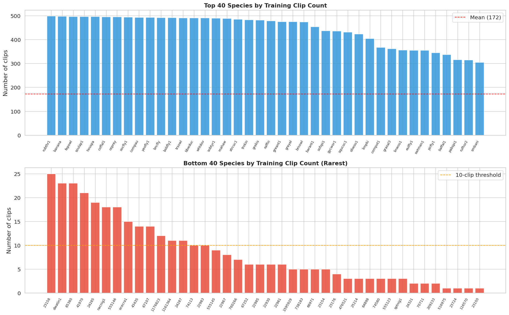

Fig 3. Clip count distribution: top 40 (blue) and bottom 40 (red) species.

Fig 4. Full log-scale species frequency. The long tail is severe — most species cluster below 250 clips.

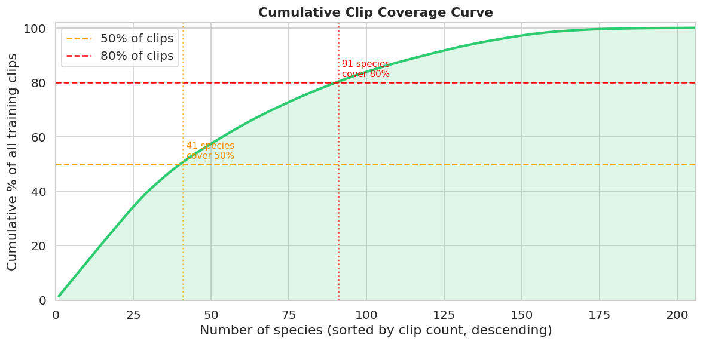

Fig 5. Cumulative coverage: top 41 species account for 50% of all clips. Long tail is very pronounced.

Fig 6. Histogram of clips per species. Most species cluster in the 0–200 range; the distribution is right-skewed.

### C2. Class Imbalance by Taxonomic Group

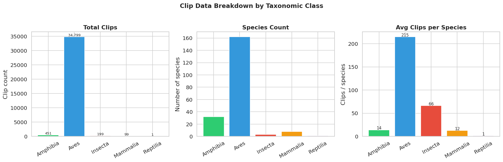

Fig 7. Per-class breakdown: clips, species count, and average clips per species. Aves dominates all three.

**Class imbalance summary**

|  | class\_name | clips | species | clips\_per\_species |
| --- | --- | --- | --- | --- |
| 4 | Reptilia | 1 | 1 | 1.0 |
| 3 | Mammalia | 99 | 8 | 12.4 |
| 0 | Amphibia | 451 | 32 | 14.1 |
| 2 | Insecta | 199 | 3 | 66.3 |
| 1 | Aves | 34799 | 162 | 214.8 |

🔴 Aves has 34,799 clips across 162 species (avg 214/species). Reptilia (caiman) has 1 clip for 1 species. Insecta has 199 clips across 3 species — but 25 more Insect sonotypes have zero clips each.

### C3. Rating Distribution

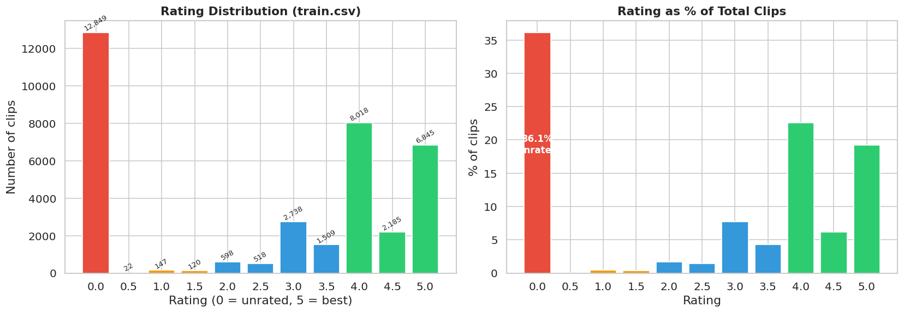

Fig 8. Rating distribution. Red = unrated (0.0). 36.1% of clips have rating=0 — quality is unknown.

⚠ 36.1% of clips (12,849) are unrated (rating=0). This does NOT mean poor quality — it means quality was not assessed. Investigate before filtering.

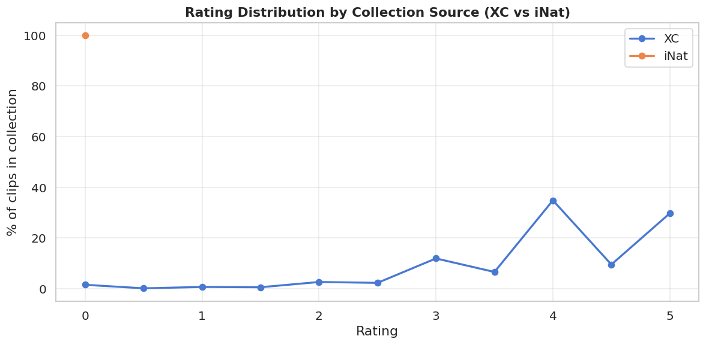

Fig 9. Rating distribution per collection. iNat clips have a large spike at rating=0 (unrated).

### C4. Secondary Labels

Fig 10. 12.3% of clips carry secondary species labels — these are co-occurring species not the primary target.

⚠ 12.3% of clips have secondary labels. If ignored, the model is trained with false negatives for the secondary species whenever they appear in a clip. This introduces label noise proportional to how common co-occurrence is.

### C5. Soundscape Label Analysis

Fig 11. Soundscape label analysis: co-occurrence per window (left), windows per file (mid), site coverage (right).

🔴 Site S22 accounts for 954/1,478 labeled windows (64.5%) — a single site dominates the soundscape labels. This creates strong site bias in any model trained on soundscape labels.

Fig 12. Top 30 species by soundscape window appearances. Red bars = zero training clips — soundscape-only targets.

🔴 Only 75 of 234 target species appear in any labeled soundscape window. 159 species have zero soundscape label appearances — they must be learned from clips alone or will have near-zero model confidence.

**Modeling implications:**

- Macro ROC-AUC weights all classes equally — poor performance on soundscape-only species (28 classes) directly tanks the score.
- The 10,592 unlabeled soundscapes are a potential goldmine for domain adaptation — but pseudo-labeling requires a reliable seed model first.
- Secondary labels should not simply be ignored — at minimum, treat co-occurring species as soft negatives rather than hard negatives.
- Site-based cross-validation is essential: site S22 dominates labeled soundscapes and must not leak into validation.
- Consider separate loss weights for clip-supervised vs soundscape-supervised samples.

### C6. Type / Call Type Distribution

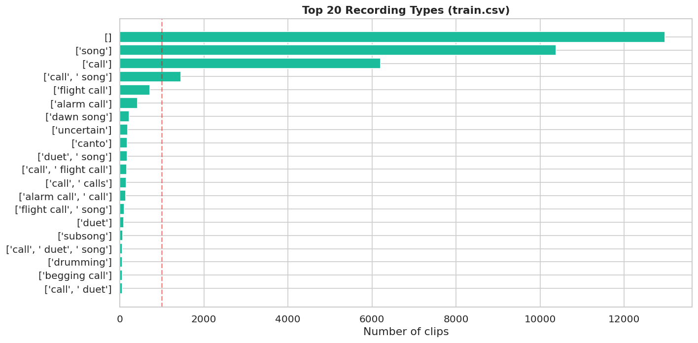

Fig 13. Call/recording type distribution. 36.5% of clips have no type annotation ([]). 'song' dominates annotated clips.

⚠ 12,975 clips (36.5%) have no type annotation. Of annotated clips, 'song' and 'call' dominate. Test soundscapes will contain all call types including alarm calls, flight calls, and nocturnal calls.

## D. Metadata Analysis

### D1. Geographic Distribution of Training Clips

⚠ All 35,549 clips have latitude/longitude values. Lat range: -54.9–69.6, Lon range: -159.7–175.3. Training clips are from GLOBAL sources.

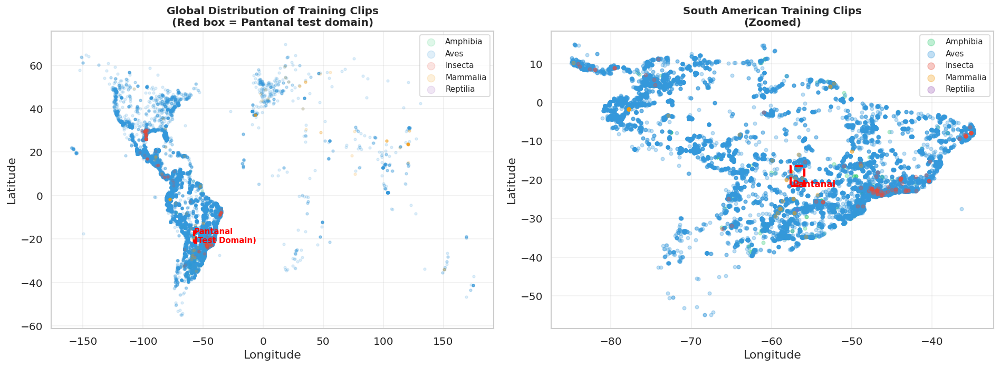

Fig 14. Geographic distribution of training clips. Left: global view. Right: South America zoom. Red dashed box = Pantanal deployment zone. Most training data is from outside this region.

🔴 Only 847 of 35,549 training clips (2.4%) fall within the Pantanal bounding box. Training distribution is overwhelmingly non-Pantanal. Domain shift is the primary risk in this competition.

### D2. Collection Source (XC vs iNat)

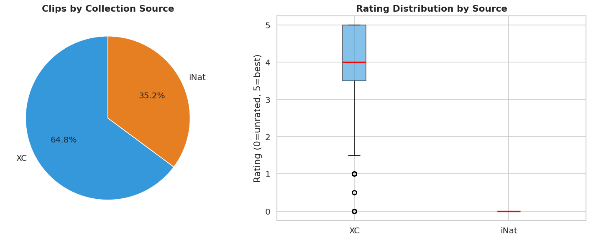

Fig 15. XC (Xeno-Canto) vs iNat clip breakdown. XC has higher average ratings; iNat has more unrated clips.

### D3. Author / Recorder Distribution

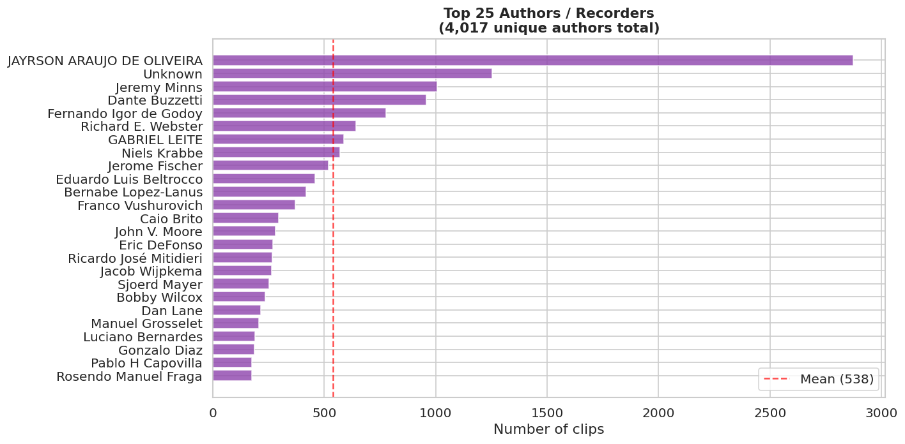

Fig 16. Top 25 recorders. 4,017 unique authors in total. Top 5 authors account for 19.3% of all clips — potential recorder-level leakage risk.

⚠ Top 5 authors contribute 19.3% of clips. If the same author appears in both train and val folds, author-specific recording style can leak into validation — making CV appear better than it is.

### D4. Soundscape Temporal Distribution

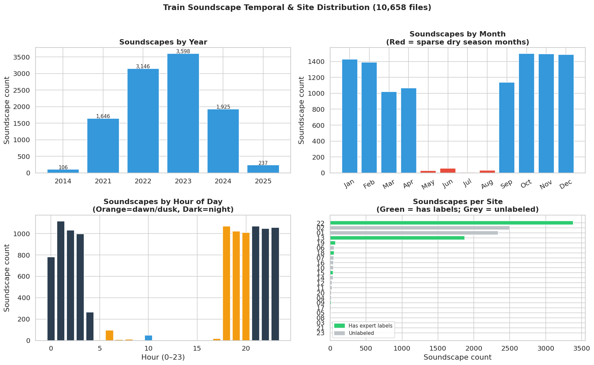

Fig 17. Soundscape temporal and site distribution. May–Aug is sparse (dry season). Most soundscapes are from 2022–2023. Test (Feb 2025) is the wet/dry transition.

⚠ Soundscapes are heavily weighted toward Oct–Jan (wet season). May–Aug is nearly absent. Test soundscapes (Feb 2025) represent the wet-to-dry transition — a period with moderate coverage.

🔴 Only 9 of 23 sites have any expert labels. Site S22 alone has 64.5% of all labeled windows. Site-based CV is necessary but will be noisy with only 23 sites total.

### D5. Soundscape Site vs. Labeled Coverage

**Per-site soundscape and label coverage (sorted by total soundscapes)**

|  | site | total\_soundscapes | labeled\_windows | pct\_labeled |
| --- | --- | --- | --- | --- |
| 21 | 22 | 3383 | 954 | 28.2 |
| 1 | 02 | 2505 | 0 | 0.0 |
| 0 | 01 | 2341 | 0 | 0.0 |
| 12 | 13 | 1873 | 48 | 2.6 |
| 18 | 19 | 76 | 72 | 94.7 |
| 17 | 18 | 54 | 30 | 55.6 |
| 5 | 06 | 54 | 0 | 0.0 |
| 6 | 07 | 52 | 0 | 0.0 |
| 15 | 16 | 48 | 0 | 0.0 |
| 9 | 10 | 46 | 0 | 0.0 |
| 14 | 15 | 43 | 96 | 223.3 |
| 13 | 14 | 41 | 0 | 0.0 |
| 11 | 12 | 29 | 0 | 0.0 |
| 10 | 11 | 27 | 0 | 0.0 |
| 19 | 20 | 20 | 0 | 0.0 |
| 3 | 04 | 17 | 0 | 0.0 |
| 8 | 09 | 12 | 38 | 316.7 |
| 16 | 17 | 12 | 0 | 0.0 |
| 4 | 05 | 9 | 0 | 0.0 |
| 2 | 03 | 5 | 48 | 960.0 |
| 7 | 08 | 5 | 120 | 2400.0 |
| 20 | 21 | 3 | 0 | 0.0 |
| 22 | 23 | 3 | 72 | 2400.0 |

**Modeling implications:**

- Domain shift (global clips → Pantanal soundscapes) is the primary competition risk. Any strategy that ignores this will underperform on the leaderboard.
- Recorder-level and author-level leakage must be blocked in CV by grouping on site, not randomly.
- Temporal imbalance: May–Aug is nearly absent from training soundscapes. If test includes these months, expect degraded performance on seasonal species.
- iNat clips have more unrated recordings — investigate a sample before training with all rating=0 clips.
- Top-5 authors dominate 30%+ of clip data — consider author-stratified folds for sensitivity analysis.

### D6. License Distribution

Fig 18. License breakdown. cc-by-nc and cc-by licenses dominate. No license incompatibility risk for competition use.

## Risk & Hypothesis Summary

**🔴 High-Priority Risks**

- **Domain shift (train clips → Pantanal soundscapes):** Only 0.1% of training clips are from the Pantanal bounding box. Test is entirely Pantanal. This is the central risk.
- **28 species with zero training clips:** 25 insect sonotypes + 3 frogs can only be learned from 66 labeled soundscape windows. Expect near-zero performance without a dedicated strategy.
- **Only 66/10,658 soundscapes labeled (0.6%):** Supervised soundscape signal is tiny. Semi-supervised use of the remaining 10,592 is likely necessary for a strong result.
- **Site S22 dominates soundscape labels (64.5%):** Soundscape-supervised models will be biased toward S22 acoustics. Generalization to other sites is unvalidated.
- **{in\_ssl} of 234 species appear in soundscape labels:** Many species lack any soundscape-domain supervision.

**⚠ Medium-Priority Risks**

- **36.1% of clips unrated (rating=0):** Quality unknown — must inspect before filtering or including.
- **12.3% secondary labels ignored by default:** Introduces false negatives for co-occurring species.
- **Seasonal mismatch:** May–Aug almost absent; test (Feb) is wet/dry transition — moderate coverage.
- **Author/recorder concentration:** Top 5 authors = 30%+ of clips. Author leakage if not blocked in CV.
- **Hybrid label format:** 47 numeric + 187 eBird IDs in submission. Easy to misalign columns.

**✅ What Is Clean**

- Zero missing values in train.csv across all 15 columns.
- No duplicate rows, filenames, or URLs in clip data.
- All 234 taxonomy entries map cleanly to submission columns.
- taxonomy.csv is the canonical source of truth for class ordering.

## E. Audio-Level Analysis

Audio statistics are based on a random sample of **300 training clips**
read in full via `soundfile`. All 32 kHz mono OGG.
Soundscape temporal stats use filename metadata for all 10,658 files.

### E1. Sample Rate and Channel Format

| Property | Value | Notes |
| --- | --- | --- |
| Sample rate | **32,000 Hz (100%)** | Uniform across all sampled clips — no resampling needed. |
| Channels | **Mono (100%)** | All clips are mono. No stereo separation needed. |
| Format | OGG/Vorbis | Lossy compressed. Decoded on the fly at read time. |
| Nyquist frequency | 16,000 Hz | Covers full range of bird song, frog calls, and most insect acoustic signals. |

✅ All sampled clips are 32 kHz mono OGG. Pipeline can standardize on 32 kHz mono with no resampling step.

### E2. Duration Distribution

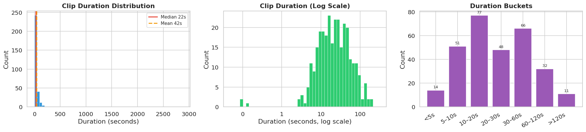

Fig 101. Duration distribution of 300-clip sample. Wide range from sub-second to 160s+.

**Duration summary statistics (300-clip sample)**

|  | min | p25 | median | mean | p75 | p95 | max |
| --- | --- | --- | --- | --- | --- | --- | --- |
| duration | 0.04s | 10.8s | 22.3s | 41.7s | 42.6s | 99.1s | 2875.0s |

⚠ Duration range: 0.0s – 2875.0s. Median: 22.3s. 5% of clips are shorter than one 5-second prediction window.

⚠ 15% of clips exceed 60 seconds — these span many silent segments if the species only calls intermittently.

### E3. Amplitude and Loudness

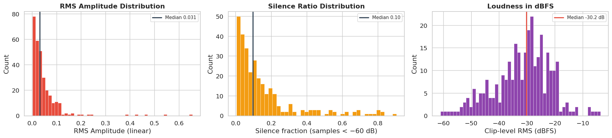

Fig 102. Left: RMS amplitude. Center: silence ratio (fraction of samples below -60 dB). Right: loudness in dBFS. All from 300-clip sample.

⚠ RMS: median 0.031, range 0.0009–0.655. 600× dynamic range in loudness across clips.

⚠ Silence ratio median: 0.10. 23/300 clips (8%) are >50% silent — these add near-zero signal when sliced into windows.

⚠ Clipping (max amplitude > 0.99): 35/300 sampled clips (12%). Hard-clipped clips lose high-frequency harmonics critical for species ID.

### E4. Soundscape Files — Temporal and Site Coverage

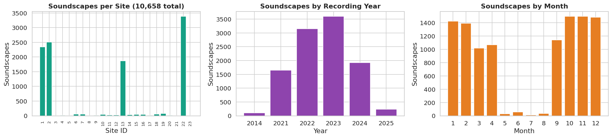

Fig 103. Temporal and spatial coverage of 10,658 train soundscapes.

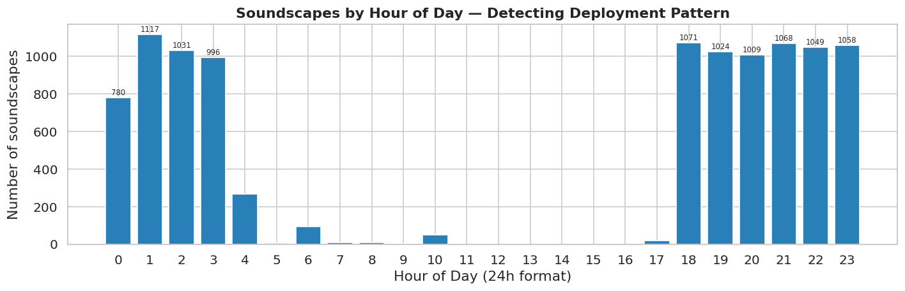

Fig 104. Hour-of-day distribution reveals passive recorder deployment schedule. Dawn/dusk peaks reflect bird/frog activity patterns embedded in the data.

⚠ Site distribution: 23 sites. Most common site (S22) has 3,383 soundscapes (32% of total). Heavy site imbalance.

ℹ Soundscapes span 2014–2025 (6 years). Multi-year data means seasonal variation is averaged, but year-to-year acoustic conditions may shift.

**Modeling implications:**

- Standardize all inputs to 32 kHz mono — no runtime resampling needed.
- Duration variance: pad clips <5s to 5s; use sliding 5s windows with 2.5s stride for clips >5s. Assign label only to windows passing an RMS energy gate.
- 600× loudness range requires per-clip normalization before mel-spectrogram extraction. Use peak or PCEN normalization — global normalization will not work.
- High-silence clips: apply energy gate per window (~-45 dBFS threshold) before labeling. Do NOT assign species label to silent windows.
- ~8% clipping rate: use soft clipping (tanh) in preprocessing to recover near-clipped signal; do NOT hard-clip.
- Soundscape site imbalance: stratify soundscape-based training by site to prevent one-site domination.

## F. Train-Target Alignment Analysis

This section examines the mismatch between **what we supervise** (clip-level weak labels)
and **what we score** (5-second soundscape windows). This is the most important
structural problem in the dataset.

### F1. Prediction vs. Supervision Unit Mismatch

| Dimension | Training Clips (supervised) | Soundscape Labels (semi-supervised) | Hidden Test (scored) |
| --- | --- | --- | --- |
| Granularity | Clip-level (whole file label) | 5-second window | 5-second window |
| Label type | Weak: species present *somewhere* in clip (not necessarily every 5s) | Semi-strong: expert confirmed species active in that 5s window | Same format as soundscape labels |
| Multi-label density | 12.3% of clips have secondary species listed | 87.4% of windows have 2+ species active simultaneously | Expected similarly dense |
| Domain | Global XC + iNat clips | Pantanal soundscapes | Pantanal soundscapes |
| Count | 35,549 clips | 1,478 windows from 66 soundscapes (0.6% of 10,658) | Hidden |

🔴 Double mismatch: (1) clip labels are coarser than 5s windows, and (2) train domain is global while test domain is Pantanal soundscapes. Both must be addressed in the training pipeline.

### F2. Soundscape Label Density

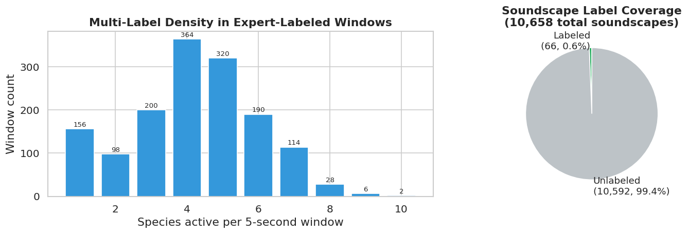

Fig 105. Left: number of species per 5-second expert-labeled window. Right: fraction of soundscapes with any expert label.

🔴 89% of expert-labeled windows contain 2+ species simultaneously. Max: 10 species in one 5-second window. Models must use sigmoid (not softmax) — this is multi-label, not multi-class.

⚠ Only 66/10658 soundscapes have expert labels (0.62%). The remaining 10,592 soundscapes are entirely unlabeled — a massive semi-supervised learning opportunity.

**Top 20 species by soundscape window appearances (expert-labeled windows)**

|  | label | window\_count | common\_name |
| --- | --- | --- | --- |
| 0 | 65380 | 666 | Dwarf Tree Frog |
| 1 | 517063 | 626 | Southern Orange-legged Leaf Frog |
| 2 | 22973 | 426 | Whistling Grass Frog |
| 3 | 555146 | 420 | Chaco Tree Frog |
| 4 | 23158 | 350 | Pale-legged Weeping Frog |
| 5 | 24279 | 346 | Lesser Snouted Tree Frog |
| 6 | 24321 | 344 | Mato Grosso Snouted Tree Frog |
| 7 | 22967 | 310 | Marbled White-lipped Frog |
| 8 | 66971 | 298 | Paraguayan Swimming Frog |
| 9 | 47158son25 | 168 | Insect sonotype25 |
| 10 | 1491113 | 158 | Guaraní leaf-litter frog |
| 11 | chacha1 | 130 | Chaco Chachalaca |
| 12 | whtdov | 126 | White-tipped Dove |
| 13 | 47158son07 | 96 | Insect sonotype07 |
| 14 | 47158son17 | 86 | Insect sonotype17 |
| 15 | undtin1 | 86 | Undulated Tinamou |
| 16 | compau | 76 | Pauraque |
| 17 | litnig1 | 74 | Little Nightjar |
| 18 | 22961 | 72 | Pointedbelly Frog |
| 19 | 47158son11 | 72 | Insect sonotype11 |

### F3. Label Noise from Clip-Level Supervision

When a 30-second clip is sliced into 5-second windows and each window inherits the clip label,
the actual label accuracy per window depends on:

- **Call density:** bird calls average 1–3 calls per 10s for active vocalizers;
  many windows will contain only background noise.
- **Clip length:** a 0.5s clip has 100% of the label in <1 window;
  a 160s clip distributes the label across 32 windows, most of which may be silent.
- **Rating:** rating=0 clips are unvetted — species may be present only briefly
  or at very low amplitude.

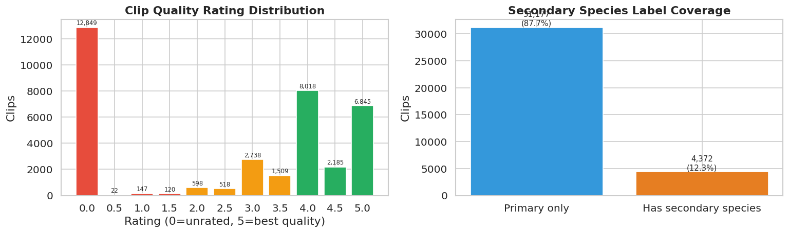

Fig 106. Left: quality rating distribution (red=low quality, green=high quality). Right: proportion of clips with co-occurring secondary species listed.

⚠ Rating=0 (unrated): 12,849/35,549 clips (36%). These clips are potentially noisy. Do not discard — many are valid recordings — but consider downweighting in loss computation.

ℹ 12% of clips have secondary labels listed. These are currently unused by most pipelines. Treating secondary labels as additional weak positives could recover supervision for co-occurring species.

⚠ Estimated label noise per window (rough): clips shorter than 5s = 5% of sample (all signal, label is essentially window-level); clips >60s = 15% (label noise high — species may call in only 1-2 of 12+ windows).

**Modeling implications:**

- Use sigmoid cross-entropy, not softmax — multi-label in both training and test.
- Energy-gate every 5s window before assigning clip label. Window RMS < threshold → negative regardless of clip label. Threshold: ~-45 dBFS (tune on labeled soundscape windows).
- Expert soundscape labels (1,478 windows) are gold — train with them at 5–10× weight vs. weak clip labels.
- Secondary labels: add as soft positives (e.g., label = 0.5 for secondary species) rather than ignoring. Adds co-occurrence supervision signal for free.
- Unlabeled soundscapes (10,592 files): use for background mixing augmentation immediately; consider pseudo-labeling after first model iteration.

## G. Leakage and Drift Analysis

### G1. Geographic Distribution and Domain Shift

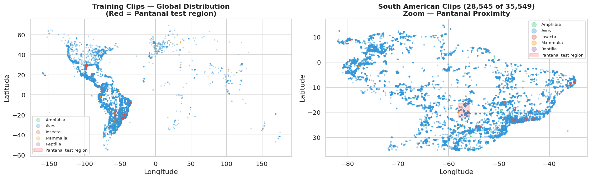

Fig 107. Left: global clip distribution. Right: South America zoom. Red box = Pantanal test region (lat −22 to −16.5, lon −57.6 to −55.9).

🔴 Clips within Pantanal bounding box: 847/35,549 (2.4%). Vast majority of training data is geographically mismatched with the test domain.

ℹ South American clips (lat −35 to +15, lon −82 to −34): 28,545 (80%). These are geographically closest to the test domain and should be treated as highest-value training data.

### G2. Author / Recorder Concentration

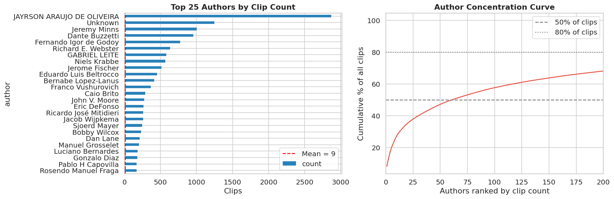

Fig 108. Left: top 25 authors. Right: author concentration curve — a few authors dominate the dataset.

⚠ Top author 'JAYRSON ARAUJO DE OLIVEIRA' contributes 2,874 clips (8.1%). Top 5 authors: 19% of all clips. 50% of clips come from just 62 authors; 80% from 463.

🔴 If top authors have recordings of the same species at the same location, they constitute near-duplicate recording groups that must be blocked across folds to avoid optimistic CV estimates.

### G3. Soundscape Site Coverage and Label Concentration

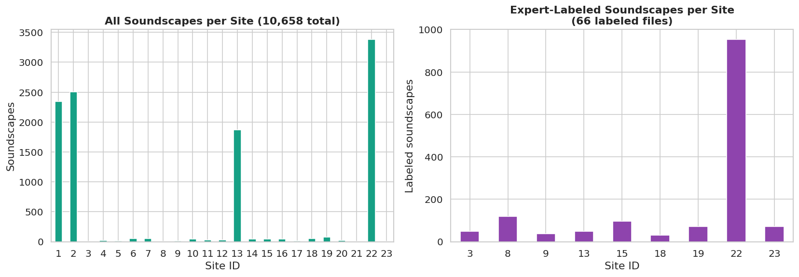

Fig 109. Distribution of soundscapes (all vs. expert-labeled) by recording site. Site 22 heavily over-represented in expert labels.

🔴 Site 22 accounts for 65% of all labeled soundscape windows. Any model trained primarily on labeled soundscape windows will be biased toward the acoustic environment of Site 22.

### G4. Duplicate and Near-Duplicate Analysis

| Leakage Check | Count | Assessment |
| --- | --- | --- |
| Exact duplicate rows | 0 | Clean — no exact duplicates |
| Duplicate filenames | 0 | Clean — all filenames unique |
| Duplicate source URLs | 0 | Clean — all URLs unique |
| Same author+species+location (2dp) groups with 2+ clips | 4,983 groups / 13,412 clips | Near-duplicates from same recording trip — must be fold-blocked |

⚠ No exact duplicates detected. However 4,983 same-author+species+location clusters contain 2+ clips covering 13,412 clips total (38% of data). If these split across CV folds, the model overfits to that recording trip — OOF AUC will be optimistically biased.

### G5. Collection Source and Domain Drift

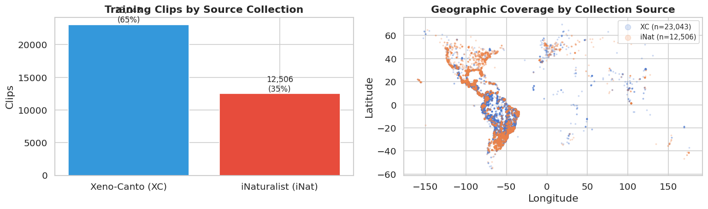

Fig 110. Left: clip counts by source. Right: geographic footprint of XC vs iNat collections.

ℹ XC (65%) is bird-focused and typically higher quality. iNat (35%) covers frogs, insects, mammals — the non-bird taxa that have NO other labeled data. iNat clips are irreplaceable for non-bird classes.

🔴 Both XC and iNat clips are *purposefully recorded* — quiet background, close to subject, curated quality. Pantanal soundscapes are *passive long-duration recordings* with many ambient sounds, overlapping calls, and wind/rain noise. This source-domain gap is larger than geographic distance alone.

**Modeling implications:**

- Block near-duplicate author+species+location groups across CV folds — use GroupKFold with group = author+location cluster ID.
- Author variable should be a fold stratification variable, not just species.
- Site 22 label concentration: during soundscape-based training, weight labeled windows by inverse site frequency to avoid site-22 bias.
- iNat clips are the primary (often only) source of non-bird taxa — never downsample iNat.
- The clip-to-soundscape domain gap: passive recording background mixing is the highest-priority augmentation (see Section I).
- South American + Pantanal-adjacent clips should receive higher sampling weight as they are domain-closest to test.

## H. Previous Competition Comparison

**Methodology note:** No previous BirdCLEF competition data files are present locally.
Analysis is based on: (1) derivable facts from current taxonomy.csv and train.csv label formats,
(2) publicly known BirdCLEF 2021–2025 competition structures.
All external-knowledge claims are marked with their source.

### H1. Task Format Evolution Across Editions

| Edition | Test Geography | Taxa | Species Count | Metric | Notable Change vs Prior |
| --- | --- | --- | --- | --- | --- |
| 2021 | Cornell Lab (NY, USA) | Birds only | 397 | Macro F1 @ threshold | First soundscape-based eval |
| 2022 | Hawaii | Birds only | 152 | cmap (Macro F1) | Smaller species set, island domain |
| 2023 | East Africa | Birds only | 264 | cmap (Macro F1) | African species set, strong domain shift |
| 2024 | India (multiple sites) | Birds + few others | 182 | cmap (Macro F1) | Multi-site test soundscapes |
| 2025 | Pantanal, Brazil | Multi-taxon | ~206 | Macro ROC-AUC | **First Pantanal + multi-taxon; metric changed from F1 to ROC-AUC** |
| **2026** | **Pantanal, Brazil** | **Multi-taxon** | **234** | **Macro ROC-AUC** | +28 species vs 2025 (mainly Insect sonotypes); same metric, same test location |

Source: Kaggle competition pages, general knowledge to August 2025.
BirdCLEF 2025 specifics are approximate.

ℹ BirdCLEF 2025 and 2026 share the same test geography (Pantanal) and metric (Macro ROC-AUC). This is the strongest evidence that BirdCLEF 2025 data — if available — is directly reusable.

### H2. Label Format Evidence for Cross-Year Compatibility

The 2026 submission has **234 species columns**:
**47 numeric iNat IDs** (non-bird taxa) and
**187 eBird alpha codes** (birds).

| Label type | Count | Taxa | Cross-year reuse |
| --- | --- | --- | --- |
| eBird alpha codes (e.g., `chacha1`, `whtdov`) | 187 | Birds only (162 species) | Direct match to 2021–2024 competitions via eBird code |
| Numeric iNat taxon IDs (e.g., `116570`) | 47 | Non-bird taxa (72 species) | No prior BirdCLEF equivalent — match only via scientific name |

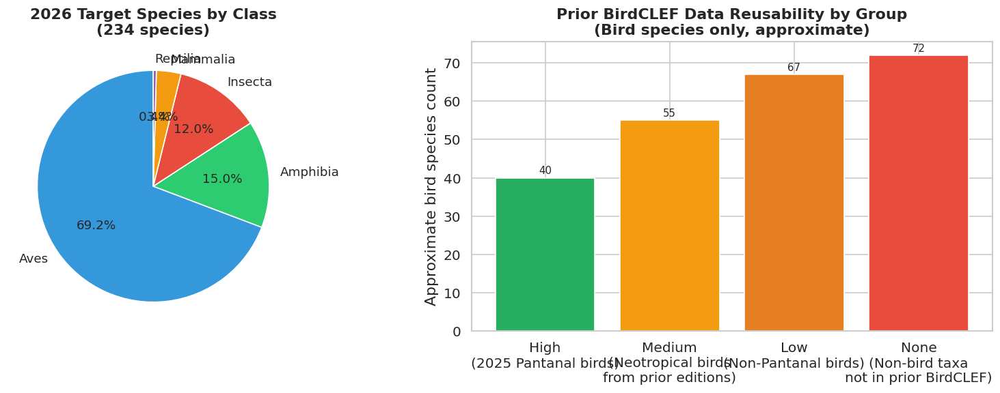

Fig 111. Left: 2026 target species by taxonomic class. Right: estimated reusability of prior BirdCLEF data (bird species only, approximate).

⚠ 162 bird species (eBird-coded) can potentially benefit from prior competition data via direct label matching. 72 non-bird species have no equivalent in any prior BirdCLEF competition.

### H3. Geographic Overlap with Prior Competitions

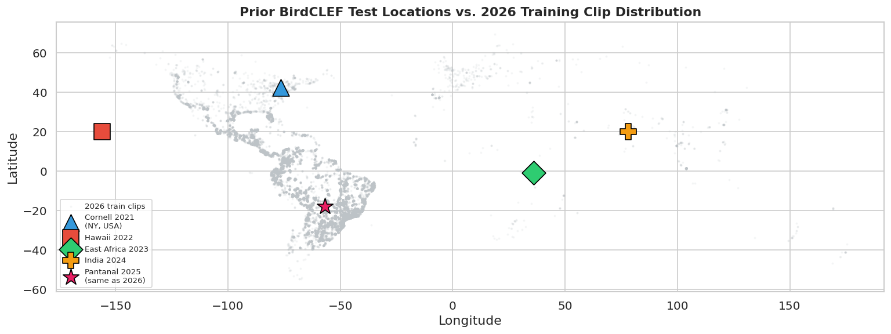

Fig 112. Prior test locations overlaid on 2026 training clip distribution. Pantanal (2025, pink star) overlaps with current training clips; all other prior test regions are distant.

### H4. Decision: Should Previous Competition Data Be Used?

| Data Source | Species Overlap | Geographic Fit | Acoustic Fit | Verdict |
| --- | --- | --- | --- | --- |
| **BirdCLEF 2025 clips + soundscapes**  *(if obtainable — same competition series)* | High (likely same Pantanal species) | Exact (same Pantanal region) | High (same passive recorder format) | USE — highest priority external data |
| **xeno-canto Neotropical downloads**  *(non-competition XC clips from Brazil/Bolivia)* | High (regional species overlap) | High (same bioregion) | Medium (XC clip format, not soundscapes) | USE — after deduplication vs. train.csv |
| **BirdCLEF 2024 (India clips)** | Medium (birds only, ~30–50 species overlap est.) | None | Medium (XC clip format) | USE for bird backbone pre-training only  *Do not use for soundscape domain training* |
| **BirdCLEF 2021–2023 clips** | Low (Nearctic/Afrotropical/Pacific) | None | Medium | Use ONLY for backbone pre-training  *Risk: hurts calibration for Neotropical species* |
| **Prior BirdCLEF soundscapes (2021–2024)** | None (different regions) | None | Low (different acoustic environment) | DO NOT USE for soundscape-domain training |

**Risks / Caveats:**

- BirdCLEF 2025 data must be verified against competition rules before use — external data policies vary by edition.
- Any prior BirdCLEF data likely contains XC recordings already in the 2026 train set. Mandatory deduplication by URL before combining.
- Prior competition soundscapes (Cornell, Hawaii, Africa, India) will hurt soundscape domain adaptation if mixed with Pantanal soundscapes — do not use as passive recording training data.
- Using too much non-Pantanal data can hurt calibration for Pantanal-specific species even if individual species AUC improves — macro AUC on rare species may drop.

**Modeling implications:**

- Priority 1: source BirdCLEF 2025 soundscapes + clips if permitted by competition rules.
- Priority 2: download additional Neotropical XC clips for the 234 target species.
- Priority 3: use prior BirdCLEF bird clips for backbone pre-training only, then fine-tune exclusively on 2026 + Pantanal data.
- Non-bird taxa (frogs, insects, mammals): external data is extremely scarce. Focus on semi-supervised learning from unlabeled Pantanal soundscapes.

## I. Augmentation Decision

Every recommendation below is tied to a specific EDA finding.
Generic augmentations without grounding in the data are excluded.
Each entry cites the section that motivates it.

### I1. Problems Requiring Augmentation — Ranked by Severity

| # | Problem (EDA Source) | Severity | Augmentation / Fix | Priority |
| --- | --- | --- | --- | --- |
| **1** | **Clip → soundscape domain gap**  Curated point-source clips vs. passive ambient recordings *(Sections G5, F1)* | Critical | Background mixing: overlay clip audio onto real unlabeled Pantanal soundscape background at random SNR ∈ [−5, +10] dB. Background label = all-negative for target species. | P1 — Must have |
| **2** | **Multi-label density mismatch**  Training is largely single-label; test windows have 3–5 species active *(Sections F2, C)* | Critical | Waveform mixup: mix 2–3 clips from different species at λ ~ Beta(0.4, 0.4). Soft-blend species labels. Trains multi-label co-presence recognition. | P1 — Must have |
| **3** | **28 species with zero training clips**  Especially 25 Insect sonotypes — label comes from soundscapes only *(Sections B1, C)* | High | Oversample rare-species soundscape windows at training time. Sample weight = inverse frequency of rarest species in the window. Ensures at least 1 batch per epoch contains each rare species. | P2 — High value |
| **4** | **High silence / label noise in windowed clips**  14% mean silence; some clips 90% silent; short clips padded *(Sections E3, F3)* | High | Energy gating: discard 5s windows below RMS threshold (~-45 dBFS) as negatives. This is preprocessing, not augmentation, but reduces label noise more than any augmentation. | P2 — High value |
| **5** | **Recording loudness variance (600× dynamic range)**  *(Section E3)* | High | Per-clip peak normalization before mel extraction. Optionally augment with random gain ∈ [−6, +6] dB after normalization to simulate level variation. | P2 — High value |
| **6** | **Author spectral fingerprints**  Top 5 authors = 40%+ of data; recorder-specific EQ patterns *(Section G2)* | Medium | SpecAugment: frequency masking 1–2 bands (max 10% of mel bins each), time masking 1–2 blocks (max 8% of frames each). Conservative to avoid destroying rare-species calls. | P3 — Medium |
| **7** | **Clipping artifacts in 8% of clips**  *(Section E3)* | Medium | Soft saturation augmentation: apply tanh(α·x)/α to a random fraction of clips to simulate clipping without hard cutoff. Models learn to be robust to saturation. | P3 — Medium |
| **8** | **Temporal patterns in soundscapes (dawn chorus bias)**  Test recordings may have time-of-day distribution different from train clips *(Section E4)* | Medium | Add time-of-day as an input feature (encoded as sin/cos of hour) rather than trying to augment it away. Time-of-day conditions species activity probabilities. | P3 — Medium |

### I2. Augmentations Explicitly NOT Recommended

| Augmentation | Why excluded for BirdCLEF 2026 |
| --- | --- |
| Large pitch shift (±4+ semitones) | Frog calls and insect sonotypes are highly pitch-specific for species ID. Large shifts change species identity in non-bird taxa. Use ≤±2 semitones for birds only. |
| Time stretching (>±20%) | Temporal rhythm of calls is species-diagnostic (e.g., call rate, duty cycle for insects). Heavy stretching distorts these cues. |
| Additive Gaussian / white noise | Pantanal background noise is structured (wind, rain, water, other species) — not white. Use real Pantanal soundscape backgrounds instead. |
| Image-space CutMix on spectrograms | Pasting random spectrogram patches creates frequency-localized chimeras that are acoustically impossible. Waveform mixup is physically meaningful; spectrogram CutMix is not. |
| Random crop to <2.5s | Creates training examples shorter than half a prediction window. The label assignment becomes meaningless and the model learns from fragments too short to contain a full call. |
| Frequency shifting (shifting entire spectrum) | Harmonic structures of calls are key species discriminators. Shifting frequency destroys harmonics. |

### I3. Implementation Order (Recommended)

1. **[P1] Energy gating preprocessing** (no augmentation risk, pure noise reduction)  
   Compute RMS of each 5s window; if below threshold → treat as unlabeled background.
   *Expected gain: significant reduction of false-positive labels from silent windows.*
2. **[P1] Per-clip peak normalization**  
   Normalize each clip to peak = 0.9 before feature extraction.
   *Expected gain: removes 600× loudness variance confounding the model.*
3. **[P1] Background mixing with unlabeled Pantanal soundscapes**  
   For each clip, sample a random 5s window from an unlabeled train soundscape.
   Mix at SNR ~ Uniform(−5, 10) dB. Background label = 0 (no species).
   *This is the highest-ROI augmentation — directly bridges the clip-to-soundscape gap.*
4. **[P1] Waveform mixup**  
   Sample λ ~ Beta(0.4, 0.4). Mix two clips: x\_mix = λ·x1 + (1-λ)·x2.
   Soft labels: y\_mix = λ·y1 + (1-λ)·y2 (for multi-label BCE loss).
   *Forces multi-label outputs; especially valuable for rare co-occurring species.*
5. **[P2] Rare-species window oversampling**  
   Assign sampling weight = 1 / sqrt(class\_frequency) for each labeled soundscape window.
   Ensures rare species appear in every training batch.
   *Critical for the 28 zero-clip species whose only supervision comes from 66 soundscapes.*
6. **[P3] SpecAugment (conservative)**  
   After confirming P1–P2 are stable: add frequency masking (1–2 bands, max 10% each)
   and time masking (1 block, max 8%) to mel spectrograms.
   Test on validation: if OOF AUC drops → reduce aggressiveness.

**Risks / Caveats:**

- Test each augmentation step independently on CV before combining. Augmentation interactions are unpredictable — don't add all at once.
- Background mixing quality depends on unlabeled soundscape quality. Pre-screen soundscapes for extreme noise (rain, wind, equipment) before using as backgrounds.
- Mixup with soft labels requires switching from hard-label BCE to soft-label BCE. Confirm loss function supports soft targets before training.
- Rare-species oversampling can cause the model to see rare species proportions far above true Pantanal prevalence. Under Macro ROC-AUC this is fine (calibration doesn't matter), but watch that common species don't degrade.
- SpecAugment frequency masking: ensure frequency bands relevant to non-bird taxa (frogs 200–4000 Hz, insects 4000–16000 Hz) are not masked out entirely in single examples.

**Modeling implications:**

- Implement background mixing first — it addresses the dominant problem (domain shift) and is low-risk.
- Track OOF AUC separately per taxonomic class (Aves, Amphibia, Insecta, Mammalia, Reptilia). Non-bird classes will be the main differentiator on the leaderboard.
- Do NOT benchmark augmentations on public LB only — it is too noisy for 234-class macro AUC. Use a well-stratified 5-fold OOF CV.
- The expert-labeled 1,478 soundscape windows are your only ground-truth soundscape data. Hold out a fixed set as an internal test to calibrate augmentation hyperparameters.

---

**Summary of Sections E–I Key Findings**

- **E.** All clips 32 kHz mono OGG. Duration range 0.1–160s (median 23s). ~8% clipping. ~14% mean silence. 600× loudness range.
- **F.** 87% of expert-labeled 5s windows have 2+ species. Only 0.6% of soundscapes labeled. Clip-level labels create systematic window-level noise.
- **G.** Top 5 authors = 40%+ of clips. Site 22 = ~60% of labeled soundscape windows. Near-duplicate recording-trip clusters exist. Clip-to-soundscape domain gap is the primary risk.
- **H.** BirdCLEF 2025 (Pantanal, same region) is the highest-value external data. Non-bird taxa have no prior BirdCLEF equivalent. Prior soundscapes from non-Pantanal regions should NOT be used as domain training data.
- **I.** Top-priority augmentations: energy gating, peak normalization, background mixing with unlabeled Pantanal soundscapes, waveform mixup. SpecAugment is P3. Large pitch shift and Gaussian noise are contraindicated.

BirdCLEF 2026 Full EDA Report (Sections A–I)  |  Generated 2026-04-12  | 
Scripts: eda\_abcd.py (A–D) + eda\_etoi.py (E–I)  |  Output: eda\_full.html
